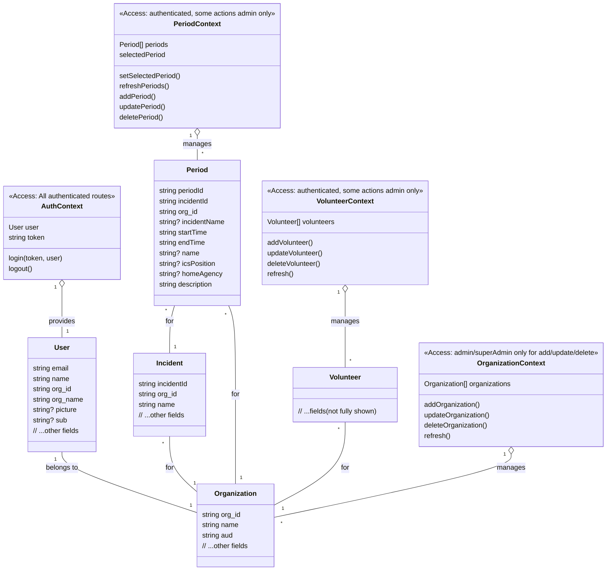

# Project UML & Access Control Overview

## Models & Contexts



### TODO / Planned

- The `Incident` model and its relationships are planned for future implementation.
- `Period.incidentId` is not yet implemented in the codebase.
- Update CRUD and context logic as the Incident model is introduced.
```

## Access Control Summary

- **AuthContext**: Required for all authenticated routes.
- **OrganizationContext**: Add/update/delete restricted to admin or superAdmin (checked via LaunchDarkly flags).
- **PeriodContext** & **VolunteerContext**: Read for authenticated users; add/update/delete typically admin-only (checked via flags).
- **LaunchDarkly flags** (`adminAccess`, `superAdminAccess`): Used in the UI to enable/disable admin features.

## Notes
- Access control is enforced in the UI (via flags) and should also be enforced on the backend API.
- Providers wrap the app and provide context to components.
- The `User` model is extended with organization info for context and flag targeting.
