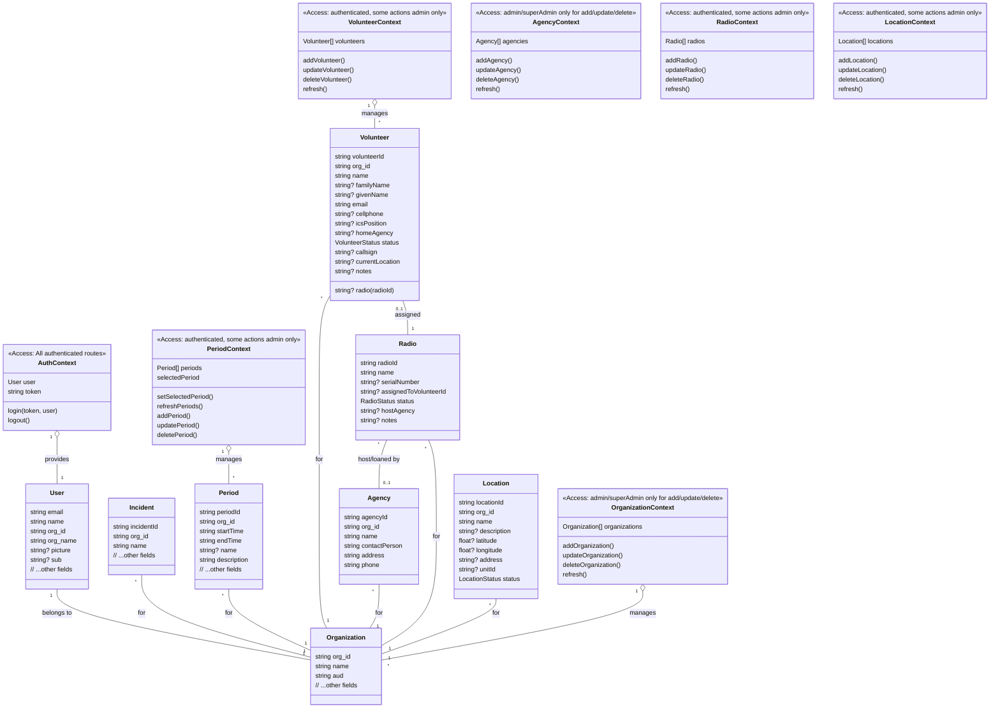

# Project UML & Access Control Overview

## Models & Contexts




### TODO / Planned

- The `Incident` model and its relationships are planned for future implementation.
- Agency, Radio, and Location CRUD/context logic to be implemented as backend endpoints are added.
```


## Contexts Overview

### AuthContext
- Provides authentication state and user info to the app.
- Exposes: `user`, `token`, `login(token, user)`, `logout()`.
- Required for all authenticated routes.

### OrganizationContext
- Manages the list of organizations for the current user.
- Exposes: `organizations`, `addOrganization()`, `updateOrganization()`, `deleteOrganization()`, `refresh()`.
- Add/update/delete restricted to admin/superAdmin.

### PeriodContext
- Manages periods (operational periods) for the current org.
- Exposes: `periods`, `selectedPeriod`, `setSelectedPeriod()`, `refreshPeriods()`, `addPeriod()`, `updatePeriod()`, `deletePeriod()`.
- Read for authenticated users; add/update/delete typically admin-only.

### VolunteerContext
- Manages volunteers for the current org.
- Exposes: `volunteers`, `addVolunteer()`, `updateVolunteer()`, `deleteVolunteer()`, `refresh()`.
- Read for authenticated users; add/update/delete typically admin-only.

### AgencyContext
- Manages agencies for the current org.
- Exposes: `agencies`, `addAgency()`, `updateAgency()`, `deleteAgency()`, `refresh()`.
- Add/update/delete restricted to admin/superAdmin.

### RadioContext
- Manages radios for the current org.
- Exposes: `radios`, `addRadio()`, `updateRadio()`, `deleteRadio()`, `refresh()`.
- Read for authenticated users; add/update/delete typically admin-only.

### LocationContext
- Manages locations for the current org.
- Exposes: `locations`, `addLocation()`, `updateLocation()`, `deleteLocation()`, `refresh()`.
- Read for authenticated users; add/update/delete typically admin-only.

---

## Access Control Summary

- **AuthContext**: Required for all authenticated routes.
- **OrganizationContext**: Add/update/delete restricted to admin or superAdmin (checked via LaunchDarkly flags).
- **PeriodContext** & **VolunteerContext**: Read for authenticated users; add/update/delete typically admin-only (checked via flags).
- **LaunchDarkly flags** (`adminAccess`, `superAdminAccess`): Used in the UI to enable/disable admin features.

## Notes
- Access control is enforced in the UI (via flags) and should also be enforced on the backend API.
- Providers wrap the app and provide context to components.
- The `User` model is extended with organization info for context and flag targeting.
